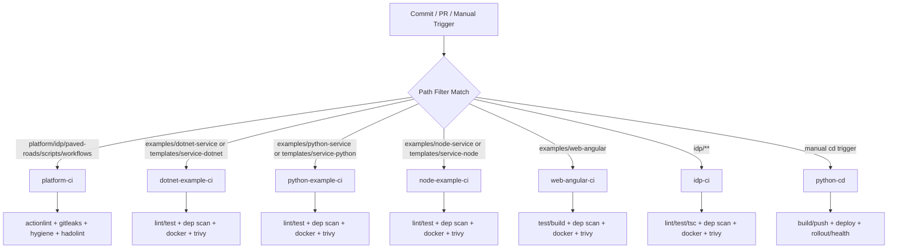

# CI Workflow Map

## Purpose
Quick reference for which GitHub Actions workflows run and how to trigger them.

## Manual Test Option
All workflows support manual execution via `workflow_dispatch`.

GitHub UI path:
1. Open `Actions` tab.
2. Select a workflow.
3. Click `Run workflow`.

## Trigger Matrix
- `platform-ci`
  - Triggered on PR/push when changing:
    - `platform/**`, `idp/**`, `paved-roads/**`, `examples/**`, `templates/**`, `scripts/**`, `.github/workflows/**`
  - Checks:
    - structure validation
    - `actionlint`
    - `gitleaks`
    - repo hygiene script
    - Dockerfile linting

- `dotnet-example-ci`
  - Triggered on PR/push when changing:
    - `examples/dotnet-service/**`, `templates/service-dotnet/**`
  - Checks:
    - restore, format, build, tests
    - dependency vulnerability scan
    - Dockerfile lint
    - container build + Trivy scan

- `python-example-ci`
  - Triggered on PR/push when changing:
    - `examples/python-service/**`, `templates/service-python/**`
  - Checks:
    - dependency install, lint, tests
    - dependency vulnerability scan
    - Dockerfile lint
    - container build + Trivy scan

- `node-example-ci`
  - Triggered on PR/push when changing:
    - `examples/node-service/**`, `templates/service-node/**`
  - Checks:
    - dependency install, lint, tests
    - dependency vulnerability scan
    - Dockerfile lint
    - container build + Trivy scan

- `web-angular-ci`
  - Triggered on PR/push when changing:
    - `examples/web-angular/**`
  - Checks:
    - dependency install, headless unit tests, build
    - dependency vulnerability scan
    - Dockerfile lint
    - container build + Trivy scan

- `idp-ci`
  - Triggered on PR/push when changing:
    - `idp/**`
  - Checks:
    - Backstage dependency install, lint, type-check, tests
    - dependency vulnerability scan
    - Dockerfile lint
    - container build + Trivy scan

- `python-cd`
  - Triggered manually (`workflow_dispatch`)
  - Stages:
    - build/push `python-service` image to GHCR
    - deploy to Kubernetes (`apps-dev` for `preview`, `apps-prod` for `promote`)
    - rollout + health verification

## Visual Flow

